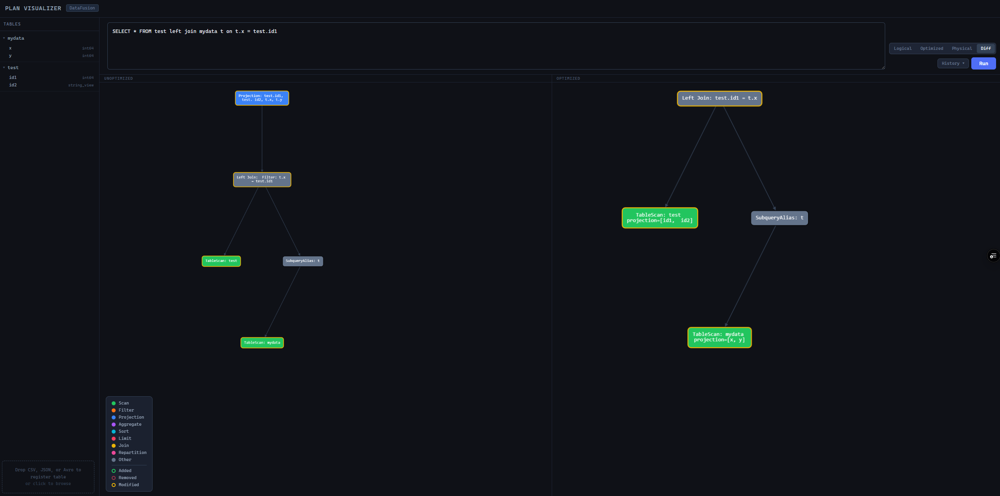
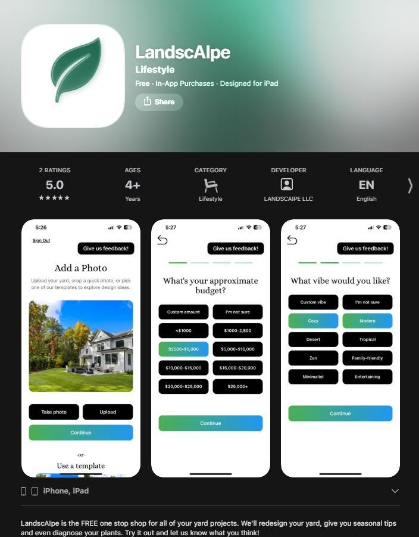
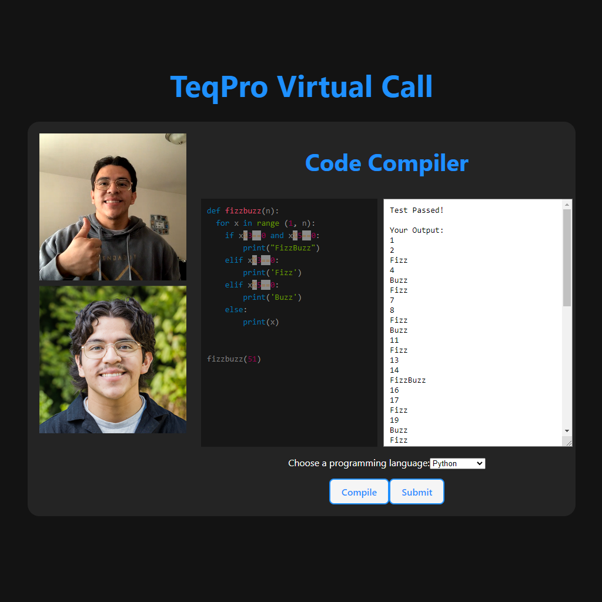
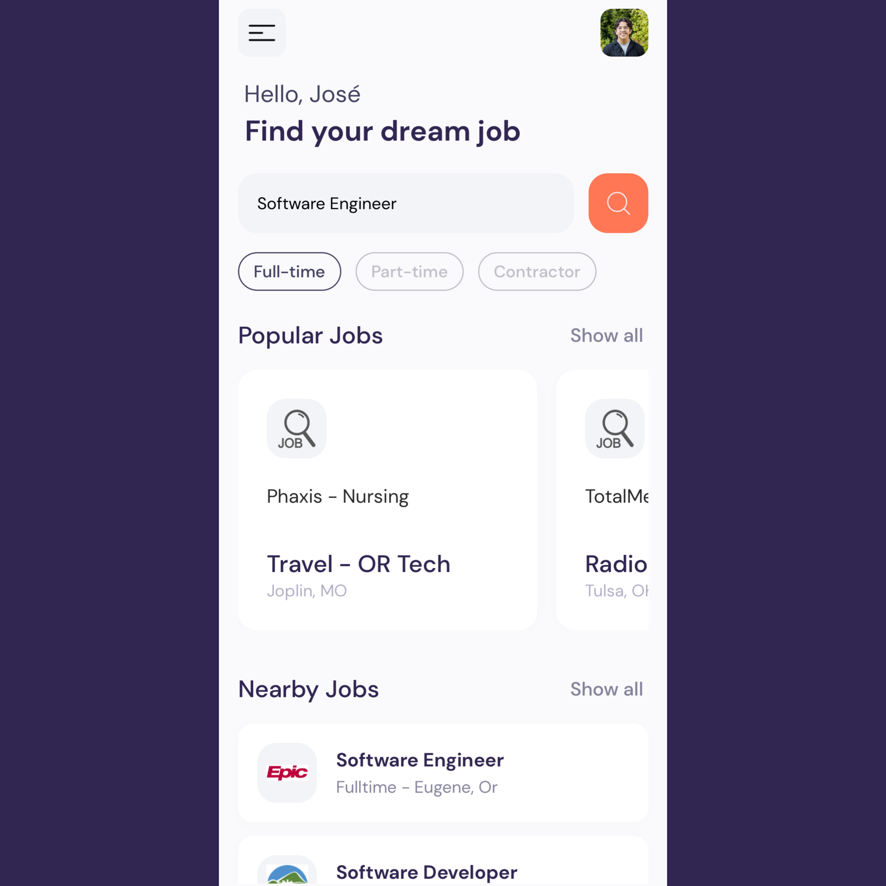
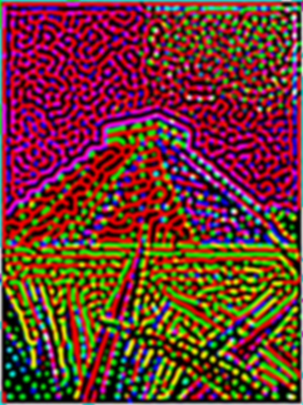

# Projects

## JrLytics
- A mini OLAP database engine built in Python. JrLytics implements segment-based columnar storage with metadata-driven query optimization on top of Apache DataFusion.
- [Github Repository](https://github.com/joserenter1a/jrlytics)

## DataFusion Plan Visualizer
- An interactive web application for visualizing query plans produced by Apache DataFusion. Write SQL against uploaded tables and inspect how DataFusion's query planner decomposes it into a tree of relational operators — across all four plan representations.
- [Live Demo](https://datafusion-plan-visualizer.vercel.app/)
- [Github Repository](https://github.com/joserenter1a/datafusion_plan_visualizer)

## LandscAIpe
- [LandscAIpe](https://landscaipeapp.com/) is an Expo/React Native mobile application for AI-powered landscaping design and contractor matching. [Live Now on the app store!](https://apps.apple.com/us/app/landscaipe/id6754616615) It targets iOS and Android, backed by Supabase (PostgreSQL + Edge Functions + Storage) and Google Gemini for image generation. It allows homeowners to:

    - Photograph their yard
    - Select landscaping features and set a budget/vibe
    - Generate AI-powered landscape design images
    - Receive cost estimates
    - Connect with matched local contractors (lead flow)
    - Access a "Yard Nerd" AI chat assistant for plant and gardening Q&A
    - The app targets iOS and Android and is published through the Apple App Store and Google Play Store via Expo EAS.

        - 

## TeqPro
- A cloud-based technical interview SaaS, with live video conferencing and a built-in compiler that supports over 30 of the most popular programming languages including Python, Javascript, C, and C++.
- [Live Demo](https://www.youtube.com/watch?v=yEGAUOvKUmY)
- [Github Repository](https://github.com/joserenter1a/teq-pro)
- 

## Auth Master
- Machine-Generated Text Detection Utility Application using Bidirectional Encoder Representations from Transformers (BERT) Model.
- [Github Repository](https://github.com/joserenter1a/Auth-Master)
- [Read the Paper](https://joserenter1a.github.io/CyberSecurity_CapStone_Final_Report.pdf)

## PySonic
- PaaS Grid-Based Python3 code editor for BLV (Blind/Low-Vision) programmers that provides sonic feedback for accessibility and ease of use.
- [Github Repository](https://github.com/joserenter1a/PySonic/)

## Dream Job
- A Cross Platform mobile application that facilitates your dream job search.
- [Github Repository](https://github.com/joserenter1a/react-native-dreamjob)

## Turing Pattern Generator
- Python Image Processing project that generates Turing Patterns, built using OpenCV and Numpy. Inspired by Alan Turing's study, "The Chemical Basis of Morphogenesis"
- [Github Repository](https://github.com/joserenter1a/turing_patterns)

| | | |
| - | - | - |
| |   |  |